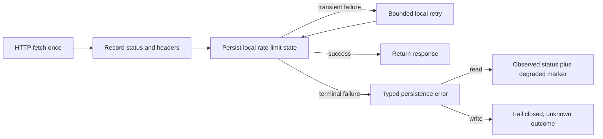

# Design T05-05

The fetch boundary is isolated from post-response accounting. Only the local save operation is retried. A terminal error retains the observed status and channel without retaining response content or sensitive headers.
