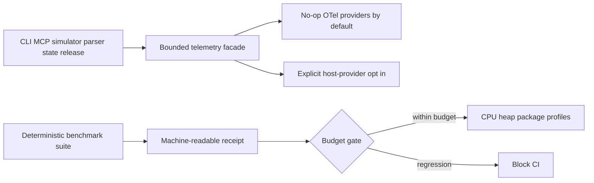

# Design T08-03

The telemetry facade uses the OpenTelemetry API but does not install a global provider or exporter. Performance automation measures real local read-only surfaces, compares results with versioned maximum budgets, and retains receipts and profiles without live network activity.

The repository-level npm peer-resolution bridge permits the exact TypeScript 7 nightly while typescript-eslint still declares support only through TypeScript 6. It is bounded by required lint, nightly typecheck, test, and compatibility jobs, and can be removed when upstream widens the peer range.
