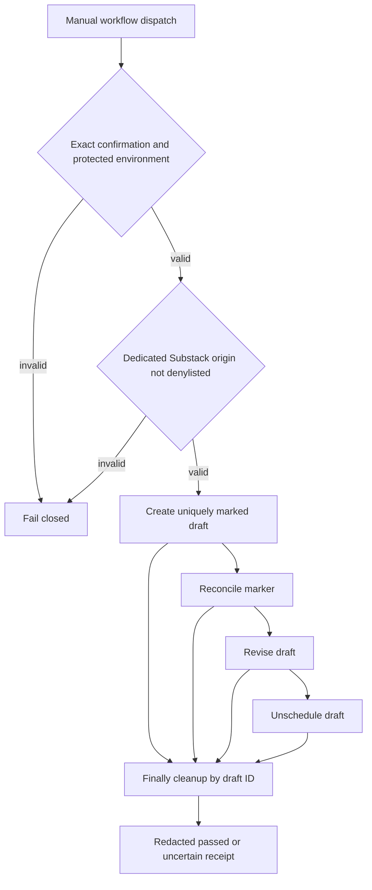

# Design T08-04

The runner accepts a reviewed same-origin lifecycle contract and constrains methods per operation. It never stores response bodies, cookies, or publication content in receipts. Compatibility CI is independent of the live write workflow and records repository-tested support separately from owner-gated or production-observed evidence.
