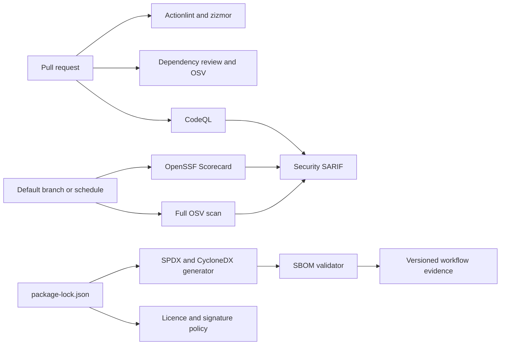

# Design

Workflow permissions default to `contents: read`. Security-event and identity-token permissions are granted only to jobs that publish SARIF or Scorecard results. Pull requests are read-only analysis surfaces; release attestations remain in T09-03 so untrusted changes cannot acquire signing authority.
