# Design T09-03

```mermaid
flowchart LR
  T[Verified version tag] --> B[Unprivileged build job]
  B --> Q[Quality and security suite]
  Q --> P[One npm tarball]
  P --> C[Clean-room install and checksum]
  C --> A[Immutable Actions artifact]
  A --> V[Checksum verification]
  V --> S[GitHub build and SBOM attestations]
  S --> N[npm OIDC trusted publish]
  N --> G[GitHub Release with exact evidence]
  G --> R[SLSA verification workflow]
  R -->|incident| D[Owner-gated deprecate and corrective release]
```

The privileged job never checks out or rebuilds source. It consumes only the verified artifact produced by the unprivileged job. npm and GitHub use short-lived OIDC credentials; no npm token is exposed to the workflow.
