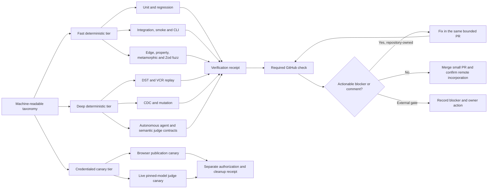
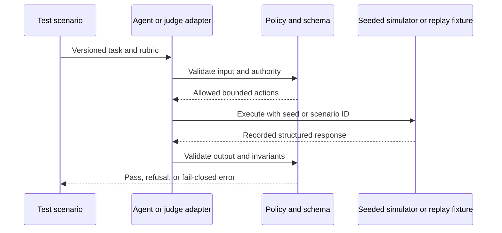

# Design

## Assurance topology

## Deterministic replay and judging

## Decisions

- Test modalities are capabilities with explicit contracts, not aliases for one broad Vitest invocation.
- Deterministic adapters and recorded responses test agent/judge integration in required CI; live-model quality is separately evidenced and never inferred.
- TUI testing is not applicable while the product has no interactive terminal UI; CLI subprocess integration remains mandatory.
- Existing unit, mutation, browser e2e, fixture-transport, and fuzz tests are retained and registered rather than duplicated without value.
