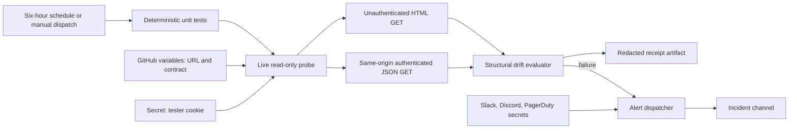

# Design

The public HTML request receives no cookie. Authenticated JSON requests are limited to reviewed same-origin paths. Redirects, oversized bodies, non-HTTPS targets, non-Substack hosts, malformed contracts, missing credentials, schema drift, and missing alert destinations fail closed. Evidence stores only origin, check names, status, and bounded diagnostics.
