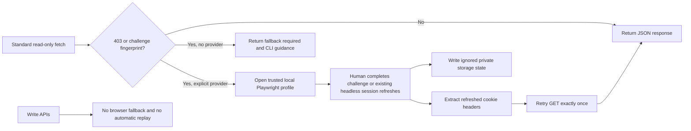

# Design

Challenge detection inspects only status, bounded response text, and server headers; returned diagnostics contain no body. Playwright state uses the existing persistent local Chrome profile and standard `cookies`/`origins` format. The CLI defaults to headed operation and fails closed if no recognized Substack session exists.
