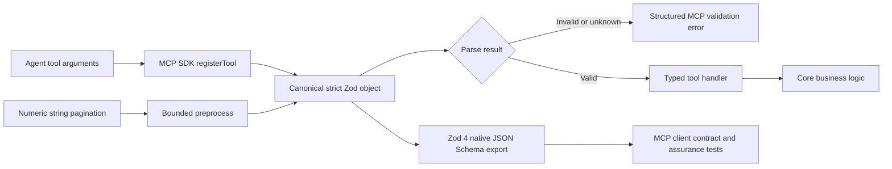

# Design

Each tool references one schema object for runtime parsing and contract export. Pagination preprocessing accepts only trimmed decimal integer strings and leaves all other values unchanged so Zod can reject them. Strict objects close the input boundary to unknown keys. Zod 4's native exporter emits Draft 2020-12 schemas from the same runtime objects, preventing hand-maintained schema drift.
