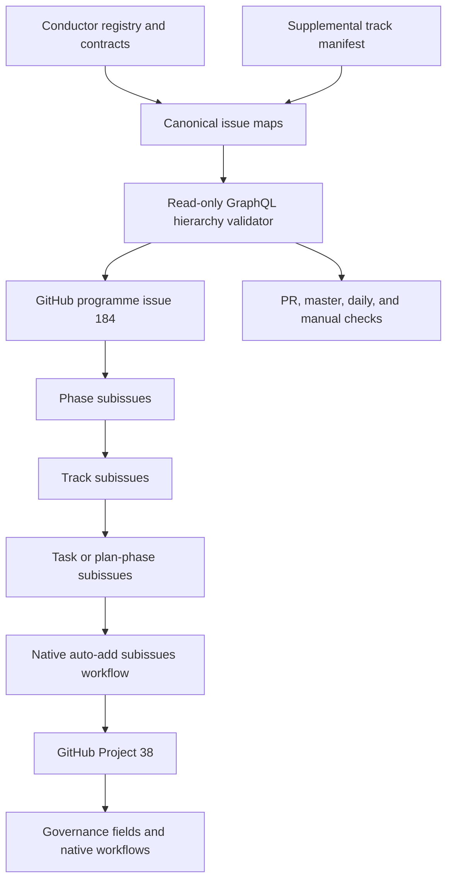

# Design

The maturity contract remains authoritative for P00-P11. Supplemental tracks use a small manifest because they were approved after the frozen maturity prompt. The validator compares committed issue numbers and exact titles with GitHub's native parent-child graph and rejects duplicate identifiers. It performs no mutations. Project #38 uses its native auto-add-subissues workflow; this avoids storing a user Project PAT in the repository while retaining native Parent issue and Sub-issues progress fields.
