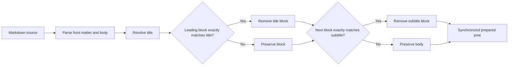

# Design T18-01

```mermaid
flowchart LR
  A["Markdown source"] --> B["Parse front matter and body"]
  B --> C["Resolve title"]
  C --> D{"Leading block exactly matches title?"}
  D -->|Yes| E["Remove title block"]
  D -->|No| F["Preserve block"]
  E --> G{"Next block exactly matches subtitle?"}
  F --> G
  G -->|Yes| H["Remove subtitle block"]
  G -->|No| I["Preserve body"]
  H --> J["Synchronized prepared post"]
  I --> J
```

Matching uses rendered block text with surrounding whitespace trimmed. Removal is limited to the first eligible title block and immediately leading subtitle block.
