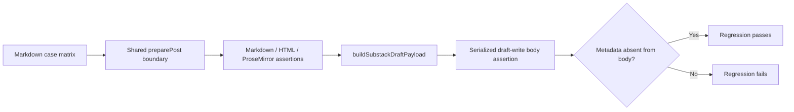

# Design T18-02

The tests intentionally inspect each representation rather than only checking a final rendered string. This prevents a later transport adapter from reintroducing a defect already fixed at preparation time.

