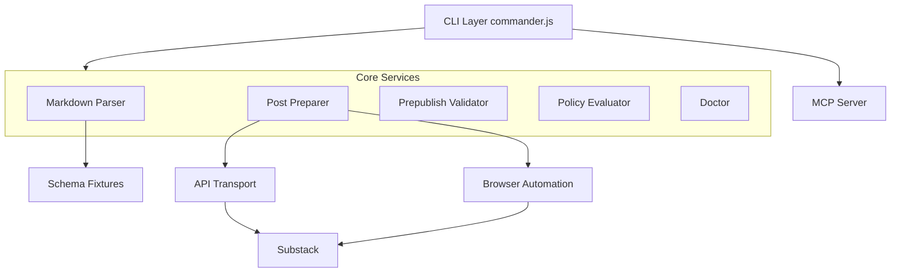
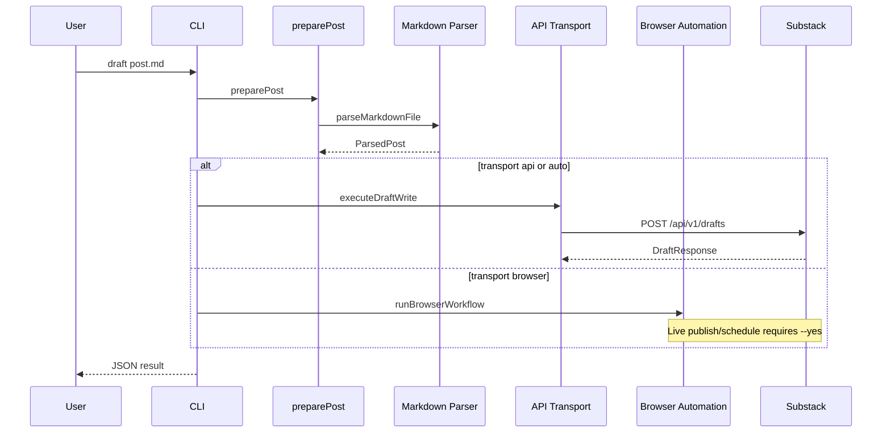
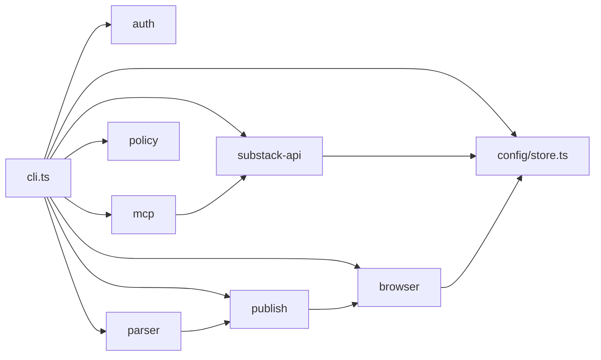
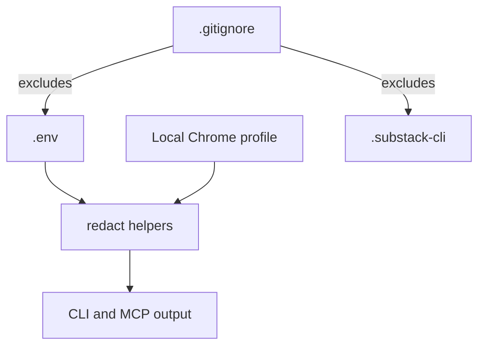
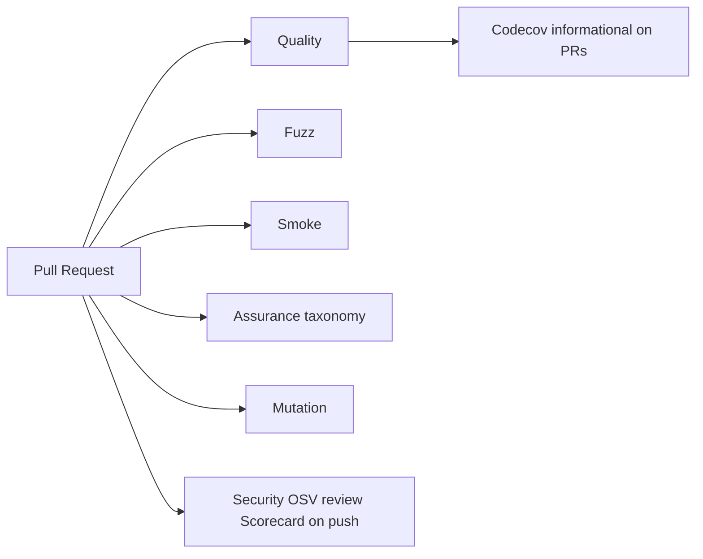

# Design: Substack Markdown Publisher CLI

> **Last updated:** 2026-08-11
> **Status:** Living Document
> **Architecture Style:** Modular monolith with dual-transport (browser automation + HTTP API)

---

## 1. System Architecture

---

## 2. Data Flow: Draft to Publish

---

## 3. Module Dependency Graph

---

## 4. Security Architecture

Live publish and schedule stay fail-closed without `--yes`. Default CI never uses Substack credentials.

---

## 5. CI/CD Pipeline

Required merge checks are listed in `docs/ruleset-solo-maintainer.json`. Review count is 0.

---

## 6. Key Design Decisions

| Decision | Choice | Rationale |
| --- | --- | --- |
| CLI | commander.js | Thin handlers over modules |
| Parser | marked + Tiptap | Markdown → HTML → ProseMirror |
| Browser | Playwright + Stagehand | Local or Browserbase |
| API | fetch + Zod | No extra HTTP client for first-party calls |
| Dual transport | `--transport browser\|api\|auto` | Auto can fall back |
| Auth | Cookie / env | No OAuth in-repo |
| Testing | Vitest, fast-check, Stryker | Taxonomy in `docs/quality-frontier.md` |
| Dependencies | Renovate | Dependabot PRs disabled |
| Reviews | 0 required | Solo maintainer; machines gate |
