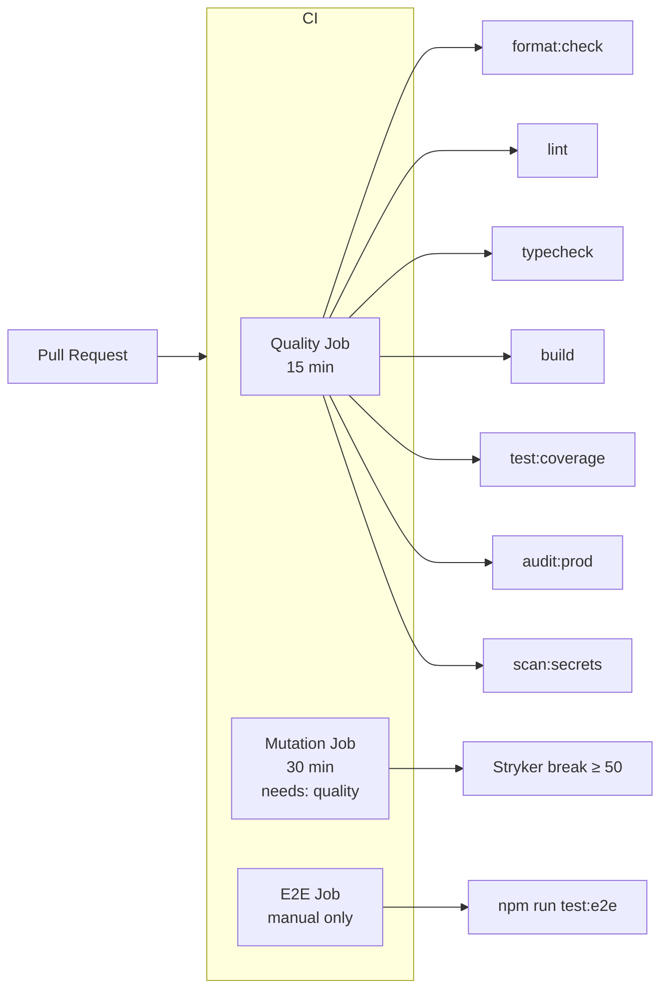

# Design: Substack Markdown Publisher CLI

> **Last updated:** 2026-05-13  
> **Status:** Living Document  
> **Architecture Style:** Modular monolith with dual-transport (browser automation + HTTP API)

---

## 1. System Architecture

```mermaid
graph TB
    CLI[CLI Layer<br/>commander.js] --> CORE[Core Services]
    CLI --> MCP[MCP Server<br/>@modelcontextprotocol/sdk]
    
    subgraph CORE[Core Services]
        PARSER[Markdown Parser<br/>marked + tiptap]
        PREP[Post Preparer<br/>preparePost]
        PREPUB[Prepublish Validator<br/>prepublishPost]
        POLICY[Policy Evaluator<br/>evaluateDistributionPolicy]
        DOCTOR[Doctor<br/>runDoctor]
    end
    
    PARSER --> SCHEMA[Schema Fixtures<br/>fixtures.ts]
    PREP --> API[API Transport Layer]
    PREP --> BROWSER[Browser Automation Layer]
    
    subgraph API[API Transport Layer]
        AUTH[Auth / Session]
        READ[Read Model]
        DRAFT_WRITE[Draft Write]
        PUBLISH_WRITE[Publish Write]
        MEDIA[Media Upload]
        PAYLOAD[Payload Builder]
        MAPPINGS[Draft Mappings]
        SECTION[Section Resolution]
        DUPLICATE[Duplicate Lookup]
        INSPECT[Draft Inspection]

---

## 2. Data Flow: Draft → Publish Pipeline

```mermaid
sequenceDiagram
    participant User
    participant CLI as CLI (commander)
    participant Prep as preparePost
    participant Parser as Markdown Parser
    participant API as API Transport
    participant Browser as Browser Automation
    participant Substack as Substack API
    
    User->>CLI: substack draft post.md
    CLI->>Prep: preparePost(post.md, {mode: "draft"})
    Prep->>Parser: parseMarkdownFile()
    Parser-->>Prep: ParsedPost (metadata + ProseMirror doc)
    
    alt Transport === "api" or "auto"
        CLI->>API: resolveApiAuthMaterial()
        API-->>CLI: ApiAuthMaterial
        CLI->>API: planCreateDraft()
        API-->>CLI: DraftWritePlan
        CLI->>API: executeDraftWrite()
        API->>Substack: POST /api/v1/drafts
        Substack-->>API: DraftResponse
        API-->>CLI: DraftWriteResult
    else Transport === "browser"
        CLI->>Browser: runBrowserWorkflow()
        Browser->>Substack: Open editor, fill fields
        Browser->>Substack: Click Publish
        Substack-->>Browser: Draft URL

---

## 3. Module Dependency Graph

```mermaid
graph LR
    CLI[cli.ts] --> CONFIG[config/store.ts]
    CLI --> AUTH[auth/*]
    CLI --> BROWSER[browser/*]
    CLI --> PARSE[parser/*]
    CLI --> PUBLISH[publish/*]
    CLI --> SUB_API[substack-api/*]
    CLI --> MCP[mcp/*]
    CLI --> POLICY[policy/distribution.ts]
    CLI --> DOCTOR[doctor/doctor.ts]
    CLI --> SCHEMA[schema/fixtures.ts]
    CLI --> UTIL[util/redact.ts]
    
    SUB_API --> CONFIG
    SUB_API --> AUTH
    SUB_API --> PARSE
    SUB_API --> PUBLISH
    
    BROWSER --> CONFIG
    BROWSER --> AUTH
    
    MCP --> SUB_API
    MCP --> BROWSER
    MCP --> POLICY
    MCP --> DOCTOR
    MCP --> SCHEMA
    MCP --> PARSE
    MCP --> PUBLISH
    
    PUBLISH --> CONFIG
    PUBLISH --> BROWSER
    PUBLISH --> SUB_API
    
    PARSE --> PUBLISH
    
    style CLI fill:#e1f5fe,stroke:#01579b
    style SUB_API fill:#e8f5e9,stroke:#2e7d32
    style BROWSER fill:#fff3e0,stroke:#e65100
    style MCP fill:#f3e5f5,stroke:#7b1fa2
```

---

## 4. Security Architecture

```mermaid
graph TB
    subgraph SECRETS[Secrets & Credentials]
        ENV[.env file]
        PROFILE[Local Chrome Profile<br/>substack.sid cookie]
        SESSION[Session File]
    end
    
    subgraph REDACT[Redaction Layer]
        R1[redact() masks secret values]
        R2[redactUrl() masks session URLs]
        R3[summarizeApiAuthMaterial()]
    end
    
    subgraph STORAGE[Storage Rules]
        GIT[.gitignore excludes secrets]
    end
    
    ENV --> R1
    PROFILE --> R1
    SESSION --> R1
    R1 --> OUTPUT[CLI Output - Redacted JSON]
    R1 --> MCP_OUT[MCP Output - Redacted]
    
    GIT -->|excludes| ENV
    GIT -->|excludes| PROFILE_DIR[.substack-cli/]
    GIT -->|excludes| BROWSER_ARTIFACTS[traces, screenshots]
```

---

## 5. CI/CD Pipeline



---

## 6. Key Design Decisions

| Decision | Choice | Rationale |
|----------|--------|-----------|
| **CLI Framework** | `commander.js` v14 | De facto standard for Node.js CLIs |
| **Parser** | `marked` + `@tiptap/core` + `@tiptap/html` | Markdown → HTML → ProseMirror; Tiptap is Substack's editor engine |
| **Browser Automation** | Playwright + Stagehand | Playwright for browser control; Stagehand for AI-driven interactions |
| **MCP** | `@modelcontextprotocol/sdk` | Standard MCP protocol for AI agent integration |
| **API Transport** | Native `fetch`, Zod validation | No extra deps; Zod ensures type safety on API responses |
| **Dual Transport** | `--transport browser|api|auto` | Users can choose; auto falls back gracefully |
| **Auth** | Cookie extraction + env vars | `substack.sid` from local Chrome; no OAuth needed |
| **Secrets** | `redact()` function on all output | Prevents accidental secret leakage |
| **Testing** | Vitest (fast), Stryker (mutation) | Vitest is modern; Stryker validates test quality |
| **Quality** | Prettier + ESLint + TypeScript strict | Enforced in CI; zero-warning lint |

        Browser-->>CLI: WorkflowResult
    end
    
    CLI->>CLI: maybeWriteTrace()
    CLI-->>User: JSON result
```

    end
    
    subgraph BROWSER[Browser Automation Layer]
        LOCAL_BROWSER[Local Browser]
        STAGEHAND[Stagehand Session]
        EDITOR[Editor Actions]
        DIAGNOSTICS[Diagnostics]
        DRAFT_CAPTURE[Draft Capture]
        DRAFT_CONTRACT[Draft Contract]
        CONTRACT_MATRIX[Contract Matrix]
        ERRORS[Error Handling]
    end
    
    API --> API_MODULES[API Feature Modules]
    AUTH --> SUBSTACK[Substack API]
    READ --> SUBSTACK
    DRAFT_WRITE --> SUBSTACK
    PUBLISH_WRITE --> SUBSTACK
    MEDIA --> SUBSTACK
    BROWSER --> SUBSTACK
```
