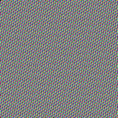

# Media Upload End-to-End Test

This file is used for automated end-to-end validation of local image upload via the Substack API transport.

## Single Local Image

## Mixed Content — Remote Images (should be skipped)

## Multiple Local Images in Sequence

## Image with No Alt Text

## Paragraph Between Images

Here is a paragraph of text separating groups of images.

