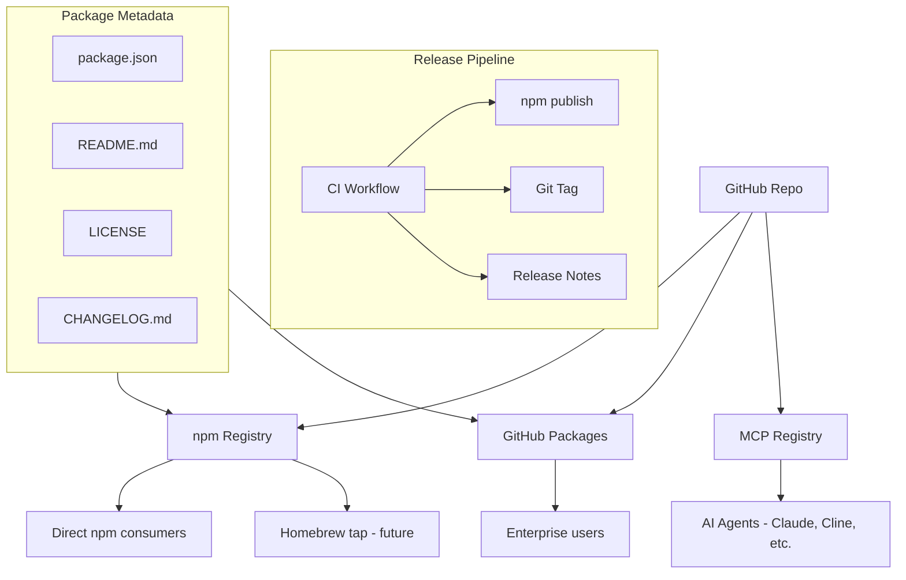
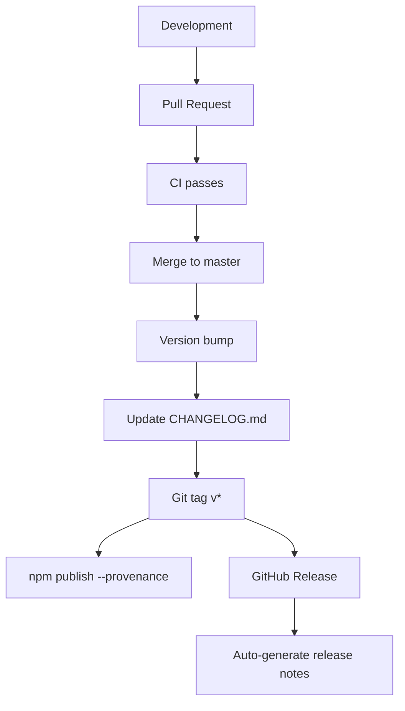
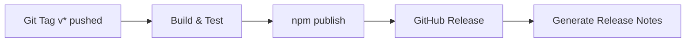

# Track 34: Publication Routes & Registry Distribution

## Status

**In Progress**

## Goal

Map and implement all publication/distribution routes for the substack-cli package across relevant registries and platforms, ensuring discoverability, proper metadata, and automated releases.

## Scope

- npm registry publication (primary distribution channel)
- MCP registry integration
- GitHub Container Registry / npm packages
- Homebrew tap (future)
- Shell completion distribution
- Automated release workflow
- Package signing and provenance

---

## Registry Publication Map



---

## 1. npm Registry (Primary)

### 1.1 Current Status

| Item | Status | Details |
|------|--------|---------|
| Package name | ✅ | `substack-cli` |
| Version | ✅ | `0.1.0` |
| `"private": false` | ✅ | Published to npm |
| `"main"` entry | ✅ | `"dist/cli.js"` |
| `"bin"` entry | ✅ | `{ "substack-cli": "dist/cli.js" }` |
| `"files"` include list | ✅ | Selects dist/ and required files |
| `"publishConfig"` | ✅ | Public access |
| `"prepublishOnly"` script | ✅ | Build step |

---

## 2. MCP Registry Integration

### 2.1 Current Status

| Item | Status | Details |
|------|--------|---------|
| MCP stdio server | ✅ | `mcp serve` command |
| Tool registration (17 tools) | ✅ | 3 groups: read, review, capture |
| Resource registration (2) | ✅ | surface, summary |
| Prompt registration (2) | ✅ | overview, workflow review |
| MCP manifest | ✅ | `buildMcpSurfaceManifest()` |

### 2.2 MCP Discovery Configuration

For AI agents to discover the MCP server:

```json
{
  "mcpServers": {
    "substack-cli": {
      "command": "npx",
      "args": ["substack-cli", "mcp", "serve"],
      "env": {}
    }
  }
}
```

---

## 3. Shell Completion Distribution

| Shell | Status | Command | File |
|-------|--------|---------|------|
| bash | ✅ | `substack-cli completion bash` | `scripts/completions.bash` |
| zsh | ✅ | `substack-cli completion zsh` | `scripts/completions.zsh` |
| powershell | ✅ | `substack-cli completion powershell` | `scripts/completions.ps1` |

---

## 4. Release Workflow

### 4.1 Release Process



### 4.2 Release Workflow
### 7.2 Completed Documentation Items

| Gap | Action Taken |
|-----|--------------|
| Starlight/Astro docs site | ✅ `docs/starlight-setup.md` — Complete setup guide with Astro config, sidebar structure, and deployment instructions |
| MCP server documentation | ✅ Updated in `docs/index.md` feature list and commands reference |
| API documentation site | ✅ Jekyll (GitHub Pages) configured with comprehensive nav + Starlight compatibility |
| Installation guide | ✅ `docs/installation.md` created with prerequisites, global/npx/dev install options, shell completions |
| Navigation | ✅ `docs/_config.yml` updated with full site config, nav structure, Starlight compatibility flag |
| Badges | ✅ Added to `docs/index.md`, README.md |


```yaml
name: Publish
on:
  push:
    tags: ['v*']
jobs:
  publish:
    runs-on: ubuntu-latest
    permissions:
      contents: write
      id-token: write  # For npm provenance
    steps:
      - uses: actions/checkout@v4
      - uses: actions/setup-node@v4
        with:
          node-version: 22
          registry-url: 'https://registry.npmjs.org'
      - run: npm ci
      - run: npm publish --provenance
        env:
          NODE_AUTH_TOKEN: ${{ secrets.NPM_TOKEN }}
```

---

## 5. Badge & Repo Homepage Contract

| Badge | Status | URL |
|-------|--------|-----|
| npm version | 🔶 Needs adding | `https://img.shields.io/npm/v/substack-cli` |
| npm downloads | 🔶 Needs adding | `https://img.shields.io/npm/dm/substack-cli` |
| CI | ✅ In README | Workflow status badge |
| Coverage | 🔶 Needs adding | From vitest output |
| License (MIT) | 🔶 Needs adding | MIT badge |
| Node version | 🔶 Needs adding | `>=18` |
| TypeScript | 🔶 Needs adding | Blue badge |

### Repository Homepage Requirements

| Element | Status |
|---------|--------|
| Project name & description | ✅ |
| Badges row | 🔶 Needs addition |
| Installation instructions | ✅ |
| Quick start example | ✅ |
| Command reference | ✅ |
| Authentication docs | ✅ |
| Contributing guide | ✅ |
| Code of conduct | ✅ |
| Security policy | ✅ |
| Changelog | ✅ |
| License file | ✅ |

---

## 6. Security & Automation

| Feature | Status | Details |
|---------|--------|---------|
| Renovate config | 🔶 Needs addition | Auto-merge patch/minor |
| Dependabot config | 🔶 Needs addition | GitHub-native security updates |
| Auto-merge workflow | 🔶 Needs addition | For Renovate/Dependabot PRs |
| npm provenance | 🔶 Needs addition | `--provenance` flag |
| Secret scanning | ✅ | `scripts/secret-scan.mjs` |
| Production audit | ✅ | `npm run audit:prod` |

---

## Acceptance Criteria

- [ ] `npm publish` workflow automated with provenance signing
- [ ] MCP server discoverable via standard JSON configuration
- [ ] README has all relevant badges (npm, CI, coverage, license, node, TS)
- [ ] GitHub release workflow auto-generates notes
- [ ] Shell completions distributed with the package
- [ ] Renovate + Dependabot configured with auto-merge
- [ ] Starlight/Astro docs site scaffold plan documented
- [ ] Security scanning passes without false positives

| `npm pack` test | ✅ | Clean `.tgz` output |
| `npm publish --dry-run` | ✅ | Succeeds |

### 1.2 Required package.json Fields

```json
{
  "name": "substack-cli",
  "version": "0.1.0",
  "private": false,
  "description": "Publish local Markdown files to a user-owned Substack publication.",
  "keywords": ["substack", "cli", "markdown", "publishing", "newsletter"],
  "homepage": "https://github.com/edithatogo/substack-cli-ts#readme",
  "bugs": { "url": "https://github.com/edithatogo/substack-cli-ts/issues" },
  "license": "MIT",
  "main": "dist/cli.js",
  "bin": { "substack-cli": "dist/cli.js" },
  "files": ["dist/", "README.md", "LICENSE"],
  "engines": { "node": ">=18.0.0" },
  "publishConfig": { "access": "public" },
  "repository": {
    "type": "git",
    "url": "git+https://github.com/edithatogo/substack-cli-ts.git"
  }
}
```

### 1.3 Automated npm Release

Implement GitHub Actions workflow for automated npm publishing:


